<div align="center">

# 🗳️ eVote — Secure Remote Voting System

*A modern, full-stack, AI-assisted remote digital voting and election management platform.*

<p align="center">
  
  
  
  
  
  
  
  
</p>

<p align="center">
  <a href="https://youtu.be/z5MCXY6QFm8"><b>🎥 View Demo</b></a> •
  <a href="https://github.com/badavathmadanlal/eVote-Telangana"><b>💻 GitHub Repo</b></a> •
  <a href="https://www.linkedin.com/in/badavathmadanlal/"><b>👨‍💻 Author</b></a>
</p>

</div>

---

## 🚀 Overview

**eVote** is a comprehensive, full-stack remote digital voting system designed to demonstrate secure electoral processes in a simulated environment. It addresses the challenges of traditional voting by offering an intuitive citizen portal, a robust election management dashboard, and a state-of-the-art AI Election Assistant. 

> ⚠️ **Note:** This is an academic prototype using simulated/demo election data. It is **NOT** connected to the Election Commission of India, Aadhaar authentication infrastructure, or any official government electoral systems.

---

## 🎯 Project Objectives

| 📌 Objective | Description |
|:---|:---|
| **Secure Authentication** | Multi-layer user validation to ensure legitimate access. |
| **Electoral Verification** | Verification checks against simulated registry databases. |
| **Election Management** | Comprehensive admin tools to create and manage elections. |
| **Duplicate-Vote Prevention**| Enforced one-vote-per-citizen policies at the database level. |
| **Secret-Ballot Workflow** | Cryptographic separation of voter identity and cast ballots. |
| **Voting Receipt Generation**| Downloadable PDF confirmations for voter assurance. |
| **Results Visualization** | Real-time analytics and graphing of electoral outcomes. |
| **Multilingual Access** | UI localization to support diverse regional demographics. |
| **AI-Assisted Info** | RAG-powered chatbot for jurisdiction-aware election FAQs. |

---

## ✨ Key Features

| Module | Description |
|:---|:---|
| 🔐 **Authentication** | Secure JWT-based login with hashed password storage (bcrypt). |
| 🪪 **Electoral Verification** | Automated validation of voter eligibility and constituency mapping. |
| 🗳️ **Voting** | Intuitive, responsive ballot interface preventing accidental submissions. |
| 🧾 **Voting Receipt** | Auto-generated PDF receipts with unique transaction hashes. |
| 📊 **Results & Analytics** | Interactive dashboard presenting live vote counts and statistics. |
| 🏛️ **Election Management** | Admin tools for candidate registration, election scheduling, and auditing. |
| 🤖 **AI Election Assistant** | Intelligent query resolution for voters regarding polling details. |
| 🌐 **Multilingual UI** | Extensible architecture allowing state-specific language toggles. |
| 📋 **Audit Logs** | Immutable tracking of administrative actions and system events. |

---

## 📊 Core Modules

<div align="center">

| Citizen Facing | Administration | Core Engine |
|:---|:---|:---|
| Citizen Portal | Admin Dashboard | Voting System |
| AI Election Assistant | Election Management | Audit System |
| Results & Analytics | Candidate Management | Results Engine |

</div>

---

## 🧭 Workflows

### 🧑‍💼 Citizen Voting Workflow

```text
 Registration
      ↓
 Authentication
      ↓
 OTP / Verification
      ↓
 Electoral Verification
      ↓
 Browse Elections
      ↓
 Review Candidates
      ↓
 Cast Vote
      ↓
 Vote Confirmation
      ↓
 PDF Receipt
      ↓
 Voting History
      ↓
 Results
```

### 🏛️ Admin Workflow

```text
 Admin Login
      ↓
 Dashboard
      ↓
 Election Management
      ↓
 Candidate Management
      ↓
 Citizen Management
      ↓
 Live Voting Monitoring
      ↓
 Results Declaration
      ↓
 Announcements
      ↓
 Audit Logs
```

---

## 🤖 AI Election Assistant

eVote features a specialized AI Assistant designed explicitly for electoral guidance:
- **Controlled Election Knowledge:** Utilizes a RAG-style (Retrieval-Augmented Generation) knowledge base.
- **Jurisdiction-Aware:** Provides information contextualized to the specific state/election.
- **Political Neutrality:** Programmed to remain unbiased and refuse candidate endorsements.
- **Ballot Secrecy Guidelines:** Refuses to ask for or store who the user voted for.
- **Out-of-Domain Rejection:** Strict prompt-injection protection to prevent off-topic AI usage.
- **Rate Limiting:** Protects the system against API abuse.

---

## 🔐 Security Measures

| Security Layer | Implementation Details |
|:---|:---|
| **JWT Authentication** | Stateless, expiring JSON Web Tokens for secure session handling. |
| **bcrypt Hashing** | Cryptographic salting and hashing for all stored credentials. |
| **HttpOnly Cookies** | Protection against Cross-Site Scripting (XSS) token theft. |
| **Helmet & CORS** | Secure HTTP headers and controlled cross-origin access. |
| **Rate Limiting** | API endpoint throttling to prevent brute-force and DDoS attacks. |
| **Input Validation** | Strict schema validation (e.g., Joi/Zod) before database writes. |
| **Role-Based Auth** | Strict separation of Citizen and Administrator routes. |
| **Duplicate Prevention** | Atomic database transactions and unique compound indexing. |

> **Disclaimer:** This project is an academic prototype and has not undergone an independent third-party security audit.

---

## 🗺️ Multi-State Demonstration

The system utilizes a simulated demographic and administrative dataset encompassing multiple regions:

| State | Capital | Simulation Scope |
|:---|:---|:---|
| **Telangana** | Hyderabad | Primary Focus Region |
| **Andhra Pradesh**| Amaravati | Demo Dataset |
| **Delhi** | New Delhi | Demo Dataset |
| **Tamil Nadu** | Chennai | Demo Dataset |
| **Maharashtra** | Mumbai | Demo Dataset |
| **Assam** | Dispur | Demo Dataset |

---

## 🛠️ Technology Stack

| Category | Technologies |
|:---|:---|
| **Frontend** | React, Vite, Tailwind CSS, JavaScript |
| **Backend** | Node.js, Express.js |
| **Database** | MongoDB, Mongoose |
| **Authentication** | JSON Web Tokens (JWT), bcrypt |
| **AI Integration** | LLM API, Retrieval-Augmented Generation (RAG) |
| **Development** | Git, npm, ESLint |

---

## 🏗️ System Architecture

```text
┌─────────────────────────┐
│     React Frontend      │
│ Pages / Components / UI │
└────────────┬────────────┘
             │ (REST / JSON)
             ▼
┌─────────────────────────┐
│     Express API         │
│ Routes / Controllers    │
│ Validators / Middleware │
└────────────┬────────────┘
             │
             ▼
┌─────────────────────────┐
│        Services         │
│ Auth / Voting / AI / RAG│
└────────────┬────────────┘
             │
             ▼
┌─────────────────────────┐
│      Repositories       │
│   Data Access Layer     │
└────────────┬────────────┘
             │
             ▼
┌─────────────────────────┐
│         MongoDB         │
│  Collections / Indexes  │
└─────────────────────────┘
```

---

## 📂 Project Structure

```text
eVote-Telangana/
│
├── client/                 # React Frontend
│   └── src/
│       ├── components/     # Reusable UI components
│       ├── pages/          # Main application views
│       ├── layouts/        # Page wrappers
│       ├── services/       # API integration
│       ├── contexts/       # Global state management
│       ├── routes/         # React Router config
│       ├── i18n/           # Internationalization
│       ├── constants/      # App-wide constants
│       └── utils/          # Helper functions
│
├── server/                 # Node.js/Express Backend
│   └── src/
│       ├── controllers/    # Request handlers
│       ├── services/       # Business logic
│       ├── repositories/   # DB interactions
│       ├── models/         # Mongoose schemas
│       ├── routes/         # Express routing
│       ├── middlewares/    # Auth, Validation, Error handling
│       ├── validators/     # Input validation schemas
│       └── constants/      # Server constants
│
├── docs/                   # Documentation & Assets
├── database/               # Seed data & schemas
├── LICENSE
└── README.md
```

---

## 🖼️ Screenshots

<table>
  <tr>
    <td align="center"><b>Home</b></td>
    <td align="center"><b>Login / Register</b></td>
  </tr>
  <tr>
    <td>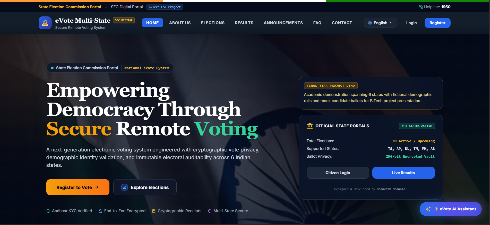</td>
    <td>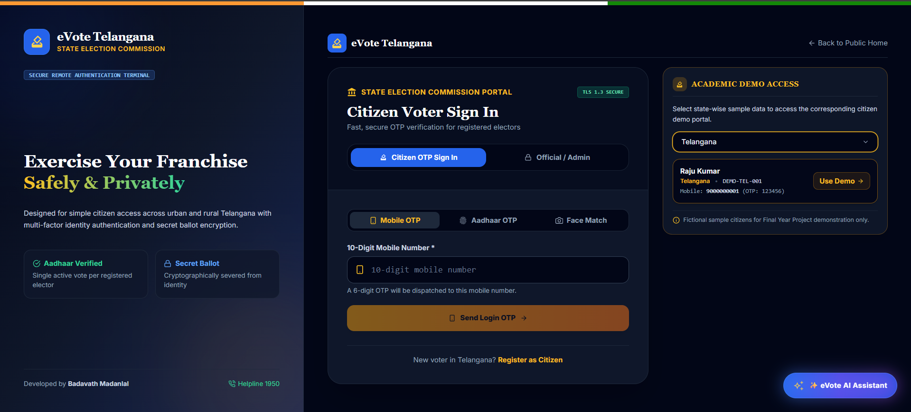</td>
  </tr>

  <tr>
    <td align="center"><b>Citizen Dashboard</b></td>
    <td align="center"><b>Voting Ballot</b></td>
  </tr>
  <tr>
    <td>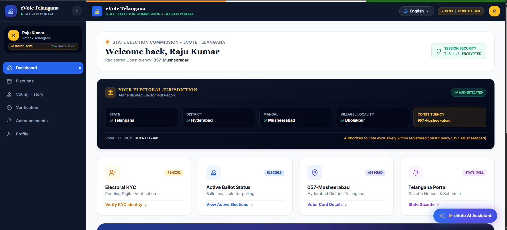</td>
    <td>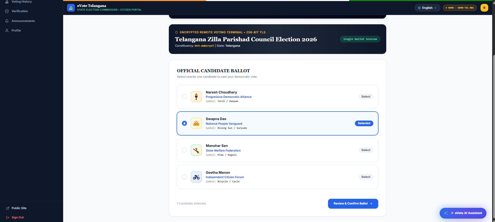</td>
  </tr>

  <tr>
    <td align="center"><b>AI Assistant</b></td>
    <td align="center"><b>Election Results</b></td>
  </tr>
  <tr>
    <td>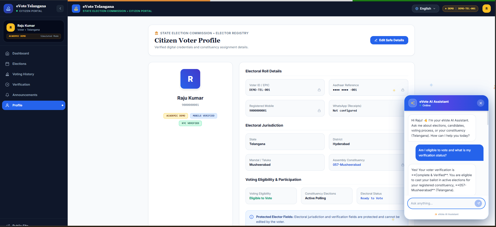</td>
    <td>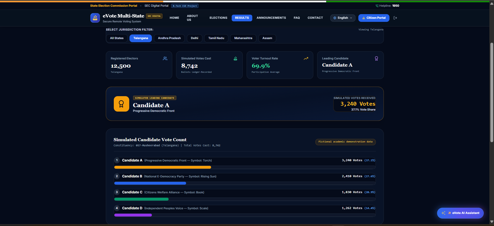</td>
  </tr>

  <tr>
    <td align="center"><b>KYC / Verification</b></td>
    <td align="center"><b>Voting History</b></td>
  </tr>
  <tr>
    <td>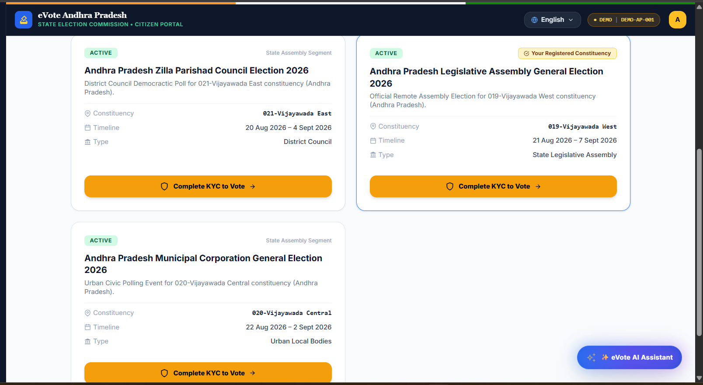</td>
    <td>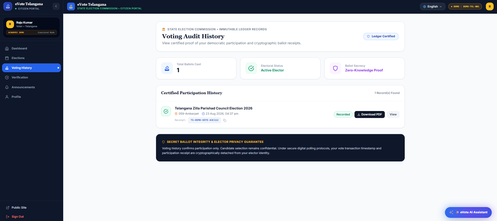</td>
  </tr>

  <tr>
    <td align="center"><b>Vote Success</b></td>
    <td align="center"><b>Already Cast Vote</b></td>
  </tr>
  <tr>
    <td>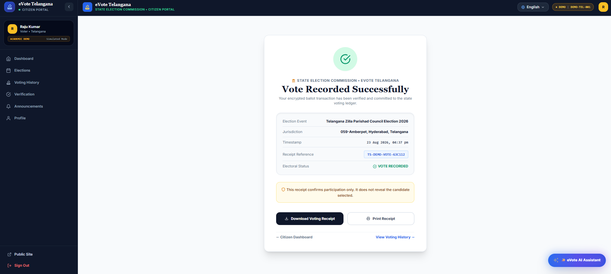</td>
    <td>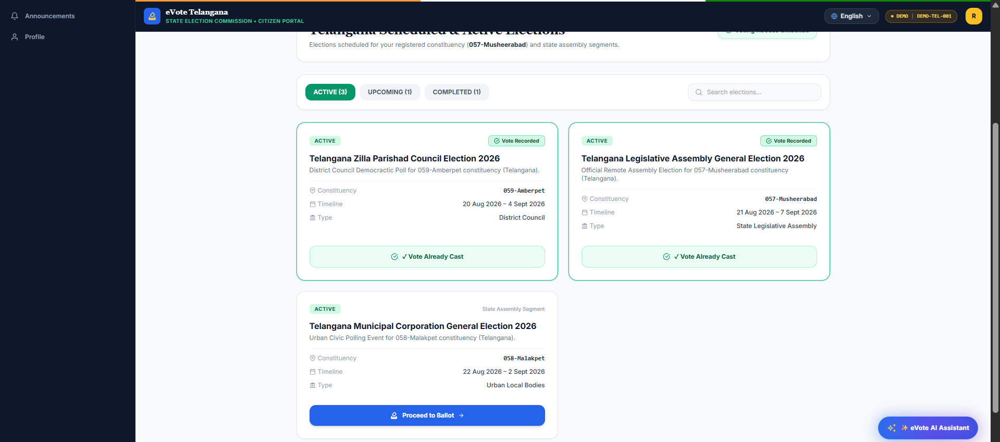</td>
  </tr>

  <tr>
    <td align="center"><b>Elections</b></td>
    <td align="center"></td>
  </tr>
  <tr>
    <td>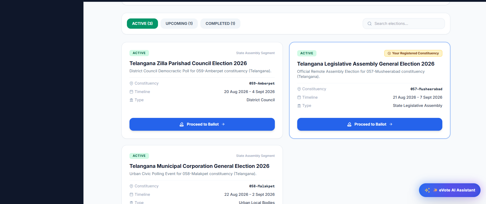</td>
    <td></td>
  </tr>
</table>

*(Note: If screenshots are not rendering, verify the `docs/assets/screenshots/` paths exist in the repository).*

---

## 🎥 Demo Video

[](https://youtu.be/z5MCXY6QFm8)

*Click the image above to watch the full project demonstration on YouTube, showcasing voter registration, the casting of a ballot, administrative tracking, and AI integration.*

---

## 📋 Project Information

| Property | Details |
|:---|:---|
| **Project Name** | eVote — Secure Remote Voting System |
| **Type** | Full-Stack Academic Project |
| **Domain** | Digital Voting / Election Management |
| **Frontend** | React |
| **Backend** | Node.js + Express |
| **Database** | MongoDB |
| **Status** | Academic Prototype |

---

## ⚙️ Installation

### 1. Clone the Repository
```bash
git clone https://github.com/badavathmadanlal/eVote-Telangana.git
cd eVote-Telangana
```

### 2. Backend Setup
```bash
cd server
npm install
cp .env.example .env
npm run dev
```

### 3. Frontend Setup
Open a new terminal window:
```bash
cd client
npm install
cp .env.example .env
npm run dev
```

---

## 🔧 Environment Configuration

To run the project locally, you will need to configure environment variables. **Never commit actual secrets to version control.**

**Server (`server/.env`):**
```env
PORT=5000
MONGO_URI=mongodb://localhost:27017/evote_demo
JWT_SECRET=your_super_secret_jwt_key
AI_API_KEY=your_ai_provider_key
# Other simulated SMS/Email gateway placeholders
```

**Client (`client/.env`):**
```env
VITE_API_BASE_URL=http://localhost:5000/api
```

---

## 🔌 API Overview

| Route Group | Description |
|:---|:---|
| `/api/auth` | Login, Registration, JWT issuing, Logout |
| `/api/elections`| Fetch active, upcoming, and past elections |
| `/api/candidates`| Fetch candidate manifestos and details |
| `/api/votes` | Cast vote, generate receipt, check voting history |
| `/api/admin` | Dashboard metrics, election creation, user management |
| `/api/ai` | RAG chatbot queries and prompt validation |

---

## ⚠️ Limitations

- **Simulated Data:** Employs dummy demographic data and is not tied to real voter rolls.
- **Academic Context:** Developed as an academic proof-of-concept.
- **No Official Integration:** Lacks connection to official electoral or identity infrastructures (e.g., UIDAI/Aadhaar).
- **Security Audit:** Has not undergone professional penetration testing or formal security auditing.
- **Third-Party Services:** Features like OTP SMS or AI generation require active external API configurations.

---

## 🔮 Future Scope

- **Production Deployment:** Migration to scalable cloud environments (AWS/GCP).
- **Independent Security Audit:** Formal verification of cryptographic workflows.
- **Stronger Identity Verification:** Integration with official identity providers (OAuth/Government APIs).
- **Cloud Scalability:** Microservices architecture for high-traffic election days.
- **Accessibility Improvements:** Screen-reader optimization and broader linguistic support.
- **Mobile Application:** Dedicated React Native apps for iOS and Android.

---

## 👨‍💻 Author

**Badavath Madanlal**

🎓 **B.Tech — Computer Science & Engineering**  
🏫 **National Institute of Technology, Silchar**  

[](https://github.com/badavathmadanlal)
[](https://www.linkedin.com/in/badavathmadanlal/)

---

## 📜 License

This project is licensed under the MIT License - see the [LICENSE](LICENSE) file for details.
